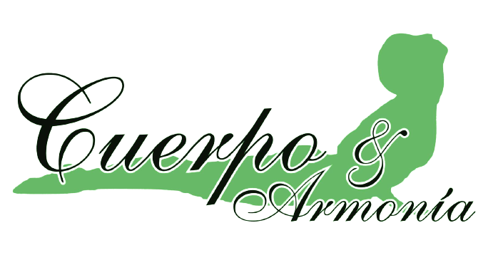

<!-- PROJECT LOGO -->
 

  

  <h3 align="center">Cuerpo & Armonía - E-Commerce ReactJS Project</h3>

  

    An ReactJS e-commerce developed as Final project of React JS course !
     
    <a href="https://github.com/JuanBenega/proyecto-react"><strong>Explore the docs »</strong></a>
     
     
    <a href="https://proyecto-react-ashen.vercel.app/">View Demo</a>
    ·
    <a href="https://github.com/JuanBenega/proyecto-react">Report Bug</a>
  

<!-- TABLE OF CONTENTS -->

  
Table of Contents

  <ol>
    <li>
      <a href="#about-the-project">About The Project</a>
      <ul>
        <li><a href="#built-with">Built With</a></li>
      </ul>
    </li>
    <li><a href="#usage">Usage</a></li>
    <li><a href="#contact">Contact</a></li>
    <li><a href="#acknowledgments">Acknowledgments</a></li>
  </ol>

<!-- ABOUT THE PROJECT -->
## About The Project

An e-commerce developed with ReactJS, using the Bootstrap CSS framework and Firebase database, has the purpose of applying the knowledge acquired in the course. I've implemented components, promises, events, hooks, rounting & navegation.

<a href="#readme-top">back to top</a>

### Built With

<a href="#readme-top">back to top</a>

<!-- USAGE EXAMPLES -->
## Usage

<a href="#readme-top">back to top</a>

<!-- CONTACT -->
## Contact

<strong>Juan Benega</strong> -  -  - jmbenega@gmail.com

Project Link: https://github.com/JuanBenega/proyecto-react

<a href="#readme-top">back to top</a>

<!-- ACKNOWLEDGMENTS -->
## Acknowledgments

* [SweetAlert](https://sweetalert.js.org/)
* [Vercel](https://vercel.com/)
* [Bootstrap Icons](https://icons.getbootstrap.com/)
* [Bootstrap Toast](https://getbootstrap.com/docs/5.0/components/toasts/)
* [React Spinners](https://www.npmjs.com/package/react-spinners)

<a href="#readme-top">back to top</a>

